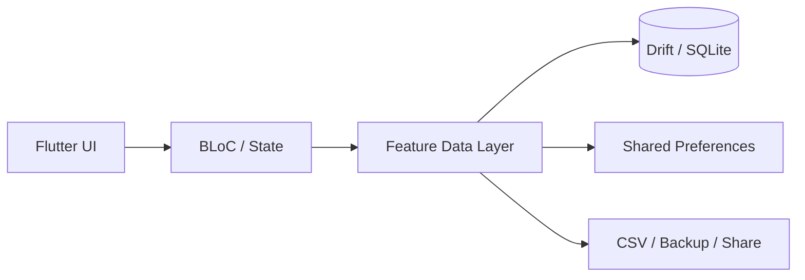

# SmartBudget

SmartBudget is an offline-first Flutter personal finance application for tracking budgets, transactions, recurring expenses, categories, reports, and backups.

The project is structured around feature modules and uses BLoC for state management with Drift/SQLite for local persistence.

## Highlights

- Budget planning and tracking
- Income and expense transaction management
- Custom spending categories
- Recurring transaction support
- Dashboard and financial summaries
- Reports and export-oriented workflows
- Local backup/restore functionality
- Offline-first local persistence

## Tech Stack

- **Flutter / Dart**
- **flutter_bloc** + **equatable** for state management
- **Drift / SQLite** for structured local persistence
- **SharedPreferences** for lightweight settings
- **CSV** for portable data workflows
- **share_plus** for file/data sharing
- **timezone / intl** for date, time, and recurring-finance handling

## Architecture



The application is organized by feature rather than by generic technical folders:

```text
lib/
├── core/
├── features/
│   ├── backup/
│   ├── budget/
│   ├── categories/
│   ├── dashboard/
│   ├── recurring/
│   ├── reports/
│   └── transactions/
└── main.dart
```

Individual features separate their data and presentation responsibilities where appropriate.

## Why This Project Matters

SmartBudget demonstrates several patterns that are useful in production mobile applications:

- predictable state management
- structured local databases
- offline-first workflows
- modular feature organization
- recurring/time-sensitive business logic
- portable user data and backup flows

## Run Locally

```bash
flutter pub get
flutter run
```

Useful verification commands:

```bash
dart format .
flutter analyze
flutter test
```

## Portfolio Note

This repository is maintained as a portfolio project demonstrating Flutter architecture, local persistence, and real-world finance workflows rather than a simple UI-only demo.
